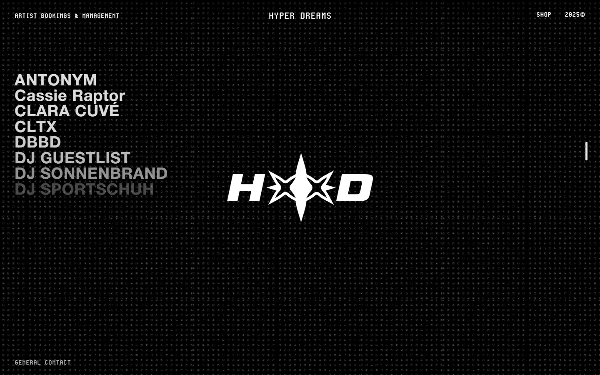
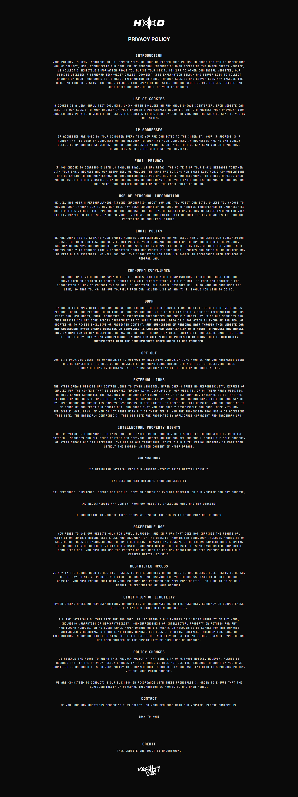
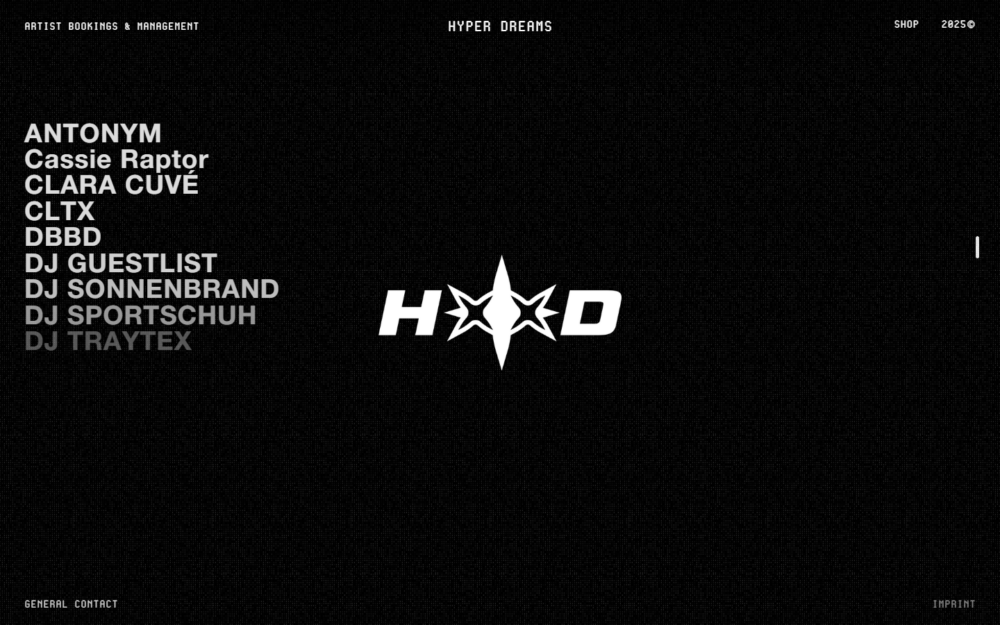
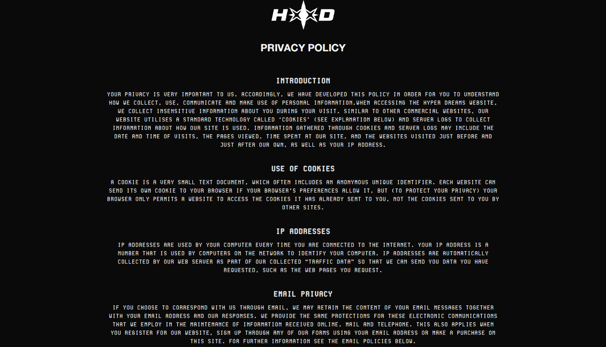
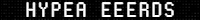
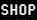
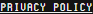
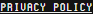

# hyper-dreams Design System

You are building UI for **hyper-dreams**. Dark-themed, cool palette, sans-serif typography (Vipnagorgialla Bd), standard density on a 5px grid, expressive motion.

## Visual Reference

**IMPORTANT**: Study ALL screenshots below before writing any UI. Match colors, typography, spacing, layout, and motion exactly as shown.

### Homepage


### Scroll Journey (Cinematic Visual States)

> These screenshots capture the website at different scroll depths. The design changes dramatically as you scroll — each frame shows a different cinematic state. Replicate these exact visual transitions.

#### 0% — Hero / Above the fold


#### 17% — Mid-page at 17% scroll


#### 33% — Mid-page at 33% scroll


#### 50% — Mid-page at 50% scroll


#### 67% — Mid-page at 67% scroll


#### 83% — Mid-page at 83% scroll


#### 100% — Footer / End of page


> Read `references/DESIGN.md` for full token details. Read `references/ANIMATIONS.md` for motion specs. Read `references/LAYOUT.md` for layout structure. Read `references/COMPONENTS.md` for component patterns.

## Ultra Reference Files

This package includes extended documentation. **Read these files before implementing:**

| File | Contents |
|------|----------|
| `references/DESIGN.md` | Full design system tokens, colors, typography, spacing |
| `references/VISUAL_GUIDE.md` | **START HERE** — Master visual guide with all screenshots embedded |
| `references/ANIMATIONS.md` | CSS keyframes, scroll triggers, motion library stack, video specs |
| `references/LAYOUT.md` | Flex/grid containers, page structure, spacing relationships |
| `references/COMPONENTS.md` | DOM component patterns, HTML structure, class fingerprints |
| `references/INTERACTIONS.md` | Hover/focus states with before/after style diffs |
| `screens/scroll/` | 7 scroll journey screenshots showing cinematic states |

### Animation Stack Detected

- **PixiJS** v5.1.5 — 3d
- **Anime.js** v3.2.1 — animation
- **Web Animations API (9 active)** — animation

## Design Philosophy

- **Layered depth** — use shadow tokens to create a sense of physical layering. Each elevation level has a specific shadow.
- **Gradient accents** — gradients are used thoughtfully for emphasis, not decoration.
- **Type pairing** — Vipnagorgialla Bd for body/UI text, webflow-icons for headings/display. Never introduce a third typeface.
- **standard density** — 5px base grid. Every dimension is a multiple of 5.
- **cool palette** — the color temperature runs cool, matching the sans-serif typography.
- **Restrained accent** — `#0050bd` is the only pop of color. Used exclusively for CTAs, links, focus rings, and active states.
- **Expressive motion** — animations are an integral part of the experience. Use spring physics and layout animations.

## Color System

### Core Palette

| Role | Token | Hex | Use |
|------|-------|-----|-----|
| Background | `--background` | `#141414` | Page/app background |
| Surface | `--surface` | `#0a0a0a` | Cards, panels, modals |
| Text Primary | `--text-primary` | `#ffffff` | Headings, body text |
| Text Muted | `--text-muted` | `#777777` | Captions, placeholders |
| Accent | `--accent` | `#0050bd` | CTAs, links, focus rings |
| Border | `--border` | `#333333` | Dividers, card borders |

### Status Colors

| Status | Hex | Use |
|--------|-----|-----|
| Danger | `#ffdede` | Errors, destructive actions |

### Extended Palette

- `#0000ee`
- `#dddddd`
- `#999999`
- `#eeeeee` — Light surface or highlight color
- `#222222`
- `#000000` — Deep background layer or shadow color
- `#758696`
- `#c8c8c8`

## Typography

### Font Stack

- **Vipnagorgialla Bd** — Heading 1, Heading 2, Heading 3
- **webflow-icons** — Body, Caption
- **Cygnito Mono** — Code

### Font Sources

```css
@font-face {
  font-family: "Cygnito Mono";
  src: url("fonts/CygnitoMono-Regular.woff2") format("woff2");
  font-weight: 400;
}
@font-face {
  font-family: "Vipnagorgialla Bd";
  src: url("fonts/VipnagorgiallaBd-Regular.woff2") format("woff2");
  font-weight: 400;
}
@font-face {
  font-family: "Vipnagorgialla Bd It";
  src: url("fonts/VipnagorgiallaBdIt-Regular.woff2") format("woff2");
  font-weight: 400;
}
@font-face {
  font-family: "webflow-icons";
  src: url("data:application/x-font-ttf;charset=utf-8;base64,AAEAAAALAIAAAwAwT1MvMg8SBiUAAAC8AAAAYGNtYXDpP+a4AAABHAAAAFxnYXNwAAAAEAAAAXgAAAAIZ2x5ZmhS2XEAAAGAAAADHGhlYWQTFw3HAAAEnAAAADZoaGVhCXYFgQAABNQAAAAkaG10eCe4A1oAAAT4AAAAMGxvY2EDtALGAAAFKAAAABptYXhwABAAPgAABUQAAAAgbmFtZSoCsMsAAAVkAAABznBvc3QAAwAAAAAHNAAAACAAAwP4AZAABQAAApkCzAAAAI8CmQLMAAAB6wAzAQkAAAAAAAAAAAAAAAAAAAABEAAAAAAAAAAAAAAAAAAAAABAAADpAwPA/8AAQAPAAEAAAAABAAAAAAAAAAAAAAAgAAAAAAADAAAAAwAAABwAAQADAAAAHAADAAEAAAAcAAQAQAAAAAwACAACAAQAAQAg5gPpA//9//8AAAAAACDmAOkA//3//wAB/+MaBBcIAAMAAQAAAAAAAAAAAAAAAAABAAH//wAPAAEAAAAAAAAAAAACAAA3OQEAAAAAAQAAAAAAAAAAAAIAADc5AQAAAAABAAAAAAAAAAAAAgAANzkBAAAAAAEBIAAAAyADgAAFAAAJAQcJARcDIP5AQAGA/oBAAcABwED+gP6AQAABAOAAAALgA4AABQAAEwEXCQEH4AHAQP6AAYBAAcABwED+gP6AQAAAAwDAAOADQALAAA8AHwAvAAABISIGHQEUFjMhMjY9ATQmByEiBh0BFBYzITI2PQE0JgchIgYdARQWMyEyNj0BNCYDIP3ADRMTDQJADRMTDf3ADRMTDQJADRMTDf3ADRMTDQJADRMTAsATDSANExMNIA0TwBMNIA0TEw0gDRPAEw0gDRMTDSANEwAAAAABAJ0AtAOBApUABQAACQIHCQEDJP7r/upcAXEBcgKU/usBFVz+fAGEAAAAAAL//f+9BAMDwwAEAAkAABcBJwEXAwE3AQdpA5ps/GZsbAOabPxmbEMDmmz8ZmwDmvxmbAOabAAAAgAA/8AEAAPAAB0AOwAABSInLgEnJjU0Nz4BNzYzMTIXHgEXFhUUBw4BBwYjNTI3PgE3NjU0Jy4BJyYjMSIHDgEHBhUUFx4BFxYzAgBqXV6LKCgoKIteXWpqXV6LKCgoKIteXWpVSktvICEhIG9LSlVVSktvICEhIG9LSlVAKCiLXl1qal1eiygoKCiLXl1qal1eiygoZiEgb0tKVVVKS28gISEgb0tKVVVKS28gIQABAAABwAIAA8AAEgAAEzQ3PgE3NjMxFSIHDgEHBhUxIwAoKIteXWpVSktvICFmAcBqXV6LKChmISBvS0pVAAAAAgAA/8AFtgPAADIAOgAAARYXHgEXFhUUBw4BBwYHIxUhIicuAScmNTQ3PgE3NjMxOAExNDc+ATc2MzIXHgEXFhcVATMJATMVMzUEjD83NlAXFxYXTjU1PQL8kz01Nk8XFxcXTzY1PSIjd1BQWlJJSXInJw3+mdv+2/7c25MCUQYcHFg5OUA/ODlXHBwIAhcXTzY1PTw1Nk8XF1tQUHcjIhwcYUNDTgL+3QFt/pOTkwABAAAAAQAAmM7nP18PPPUACwQAAAAAANciZKUAAAAA1yJkpf/9/70FtgPDAAAACAACAAAAAAAAAAEAAAPA/8AAAAW3//3//QW2AAEAAAAAAAAAAAAAAAAAAAAMBAAAAAAAAAAAAAAAAgAAAAQAASAEAADgBAAAwAQAAJ0EAP/9BAAAAAQAAAAFtwAAAAAAAAAKABQAHgAyAEYAjACiAL4BFgE2AY4AAAABAAAADAA8AAMAAAAAAAIAAAAAAAAAAAAAAAAAAAAAAAAADgCuAAEAAAAAAAEADQAAAAEAAAAAAAIABwCWAAEAAAAAAAMADQBIAAEAAAAAAAQADQCrAAEAAAAAAAUACwAnAAEAAAAAAAYADQBvAAEAAAAAAAoAGgDSAAMAAQQJAAEAGgANAAMAAQQJAAIADgCdAAMAAQQJAAMAGgBVAAMAAQQJAAQAGgC4AAMAAQQJAAUAFgAyAAMAAQQJAAYAGgB8AAMAAQQJAAoANADsd2ViZmxvdy1pY29ucwB3AGUAYgBmAGwAbwB3AC0AaQBjAG8AbgBzVmVyc2lvbiAxLjAAVgBlAHIAcwBpAG8AbgAgADEALgAwd2ViZmxvdy1pY29ucwB3AGUAYgBmAGwAbwB3AC0AaQBjAG8AbgBzd2ViZmxvdy1pY29ucwB3AGUAYgBmAGwAbwB3AC0AaQBjAG8AbgBzUmVndWxhcgBSAGUAZwB1AGwAYQByd2ViZmxvdy1pY29ucwB3AGUAYgBmAGwAbwB3AC0AaQBjAG8AbgBzRm9udCBnZW5lcmF0ZWQgYnkgSWNvTW9vbi4ARgBvAG4AdAAgAGcAZQBuAGUAcgBhAHQAZQBkACAAYgB5ACAASQBjAG8ATQBvAG8AbgAuAAAAAwAAAAAAAAAAAAAAAAAAAAAAAAAAAAAAAAAAAAAAAA==") format("truetype");
  font-weight: 400;
}
@font-face {
  font-family: "Helvetica Neue Bold";
  src: url("https://cdn.prod.website-files.com/6472a0480700b4ffad5ca638/64766b60e983b419bf1bd29d_HelveticaNeue%20Bold.woff2") format("woff2");
  font-weight: 700;
}
```

### Type Scale

| Role | Family | Size | Weight |
|------|--------|------|--------|
| Heading 1 | Vipnagorgialla Bd | 40px | 700 |
| Heading 2 | Vipnagorgialla Bd | 38px | 700 |
| Heading 3 | Vipnagorgialla Bd | 32px | 700 |
| Body | webflow-icons | 14px | 400 |
| Caption | webflow-icons | 12px | 400 |
| Code | Cygnito Mono | 14px | 400 |

### Typography Rules

- Body/UI: **Vipnagorgialla Bd**, Headings: **webflow-icons** — these are the only display fonts
- Max 3-4 font sizes per screen
- Headings: weight 600-700, body: weight 400
- Use color and opacity for text hierarchy, not additional font sizes
- Line height: 1.5 for body, 1.2 for headings

## Spacing & Layout

### Base Grid: 5px

Every dimension (margin, padding, gap, width, height) must be a multiple of **5px**.

### Spacing Scale

`5, 10, 15, 20, 25, 30, 35, 40, 50, 60, 70, 75` px

### Spacing as Meaning

| Spacing | Use |
|---------|-----|
| 2.5-5px | Tight: related items within a group |
| 10px | Medium: between groups |
| 15-20px | Wide: between sections |
| 30px+ | Vast: major section breaks |

### Border Radius

Scale: `unset, 2px, 3px, 4px, 5px, 12px, 20px, 50px, 100%`
Default: `5px`

### Container

Max-width: `991px`, centered with auto margins.

### Breakpoints

| Name | Value |
|------|-------|
| xs | 479px |
| md | 767px |
| md | 768px |
| lg | 991px |
| lg | 992px |

Mobile-first: design for small screens, layer on responsive overrides.

## Component Patterns

### Card

```css
.card {
  background: #0a0a0a;
  border: 1px solid #333333;
  border-radius: 5px;
  padding: 20px;
  box-shadow: unset;
}
```

```html
<div class="card">
  <h3>Card Title</h3>
  <p>Card content goes here.</p>
</div>
```

### Button

```css
/* Primary */
.btn-primary {
  background: #0050bd;
  color: #ffffff;
  border-radius: 5px;
  padding: 10px 20px;
  font-weight: 500;
  transition: opacity 150ms ease;
}
.btn-primary:hover { opacity: 0.9; }

/* Ghost */
.btn-ghost {
  background: transparent;
  border: 1px solid #333333;
  color: #ffffff;
  border-radius: 5px;
  padding: 10px 20px;
}
```

```html
<button class="btn-primary">Get Started</button>
<button class="btn-ghost">Learn More</button>
```

### Input

```css
.input {
  background: #141414;
  border: 1px solid #333333;
  border-radius: 5px;
  padding: 10px 15px;
  color: #ffffff;
  font-size: 14px;
}
.input:focus { border-color: #0050bd; outline: none; }
```

```html
<input class="input" type="text" placeholder="Search..." />
```

### Badge / Chip

```css
.badge {
  display: inline-flex;
  align-items: center;
  padding: 5px 10px;
  border-radius: 9999px;
  font-size: 12px;
  font-weight: 500;
  background: #0a0a0a;
  color: #777777;
}
```

```html
<span class="badge">New</span>
<span class="badge">Beta</span>
```

### Modal / Dialog

```css
.modal-backdrop { background: rgba(0, 0, 0, 0.6); }
.modal {
  background: #0a0a0a;
  border: 1px solid #333333;
  border-radius: 100%;
  padding: 30px;
  max-width: 480px;
  width: 90vw;
  box-shadow: 0 8px 50px #0000000d;
}
```

```html
<div class="modal-backdrop">
  <div class="modal">
    <h2>Dialog Title</h2>
    <p>Dialog content.</p>
    <button class="btn-primary">Confirm</button>
    <button class="btn-ghost">Cancel</button>
  </div>
</div>
```

### Table

```css
.table { width: 100%; border-collapse: collapse; }
.table th {
  text-align: left;
  padding: 10px 15px;
  font-weight: 500;
  font-size: 12px;
  color: #777777;
  text-transform: uppercase;
  letter-spacing: 0.05em;
  border-bottom: 1px solid #333333;
}
.table td {
  padding: 15px;
  border-bottom: 1px solid #333333;
}
```

```html
<table class="table">
  <thead><tr><th>Name</th><th>Status</th><th>Date</th></tr></thead>
  <tbody>
    <tr><td>Item One</td><td>Active</td><td>Jan 1</td></tr>
    <tr><td>Item Two</td><td>Pending</td><td>Jan 2</td></tr>
  </tbody>
</table>
```

### Navigation

```css
.nav {
  display: flex;
  align-items: center;
  gap: 10px;
  padding: 15px 20px;
  border-bottom: 1px solid #333333;
}
.nav-link {
  color: #777777;
  padding: 10px 15px;
  border-radius: 5px;
  transition: color 150ms;
}
.nav-link:hover { color: #ffffff; }
.nav-link.active { color: #0050bd; }
```

```html
<nav class="nav">
  <a href="/" class="nav-link active">Home</a>
  <a href="/about" class="nav-link">About</a>
  <a href="/pricing" class="nav-link">Pricing</a>
  <button class="btn-primary" style="margin-left: auto">Get Started</button>
</nav>
```

## Page Structure

The following page sections were detected:

- **Navigation** — Top navigation bar (2 items)
- **Hero** — Hero section (detected from heading structure)

When building pages, follow this section order and structure.

## Animation & Motion

This project uses **expressive motion**. Animations are part of the design language.

### CSS Animations

- `fa-beat`
- `fa-bounce`
- `fa-fade`
- `fa-beat-fade`
- `fa-flip`

### Motion Tokens

- **Duration scale:** `0s`, `1ms`, `100ms`, `200ms`, `300ms`
- **Easing functions:** `cubic-bezier(.215,.61,.355,1)`, `cubic-bezier(.165,.84,.44,1)`, `ease-in-out`

### Motion Guidelines

- **Duration:** Use values from the duration scale above. Short (0s) for micro-interactions, long (300ms) for page transitions
- **Easing:** Use `cubic-bezier(.215,.61,.355,1)` as the default easing curve
- **Direction:** Elements enter from bottom/right, exit to top/left
- **Reduced motion:** Always respect `prefers-reduced-motion` — disable animations when set

## Depth & Elevation

### Shadow Tokens

- Subtle: `0 0 0 2px #fff`
- Raised (cards, buttons): `unset`
- Raised (cards, buttons): `0 0 0 1px #0000001a,0 1px 3px #0000001a`
- Raised (cards, buttons): `0 0 3px #3336`
- Overlay (modals, dialogs): `0 8px 50px #0000000d`

### Z-Index Scale

`1, 2, 3, 4, 5, 7, 8, 9, 10, 20, 900, 1000, 2000, 99999, 999999, 999999999, 2147483647`

Use these exact values — never invent z-index values.

## Anti-Patterns (Never Do)

- **No blur effects** — no backdrop-blur, no filter: blur()
- **No zebra striping** — tables and lists use borders for separation
- **No invented colors** — every hex value must come from the palette above
- **No arbitrary spacing** — every dimension is a multiple of 5px
- **No extra fonts** — only Vipnagorgialla Bd and webflow-icons and Cygnito Mono are allowed
- **No arbitrary border-radius** — use the scale: 2px, 3px, 4px, 5px, 12px, 20px, 50px
- **No opacity for disabled states** — use muted colors instead

## Workflow

1. **Read** `references/DESIGN.md` before writing any UI code
2. **Pick colors** from the Color System section — never invent new ones
3. **Set typography** — Vipnagorgialla Bd, webflow-icons, Cygnito Mono only, using the type scale
4. **Build layout** on the 5px grid — check every margin, padding, gap
5. **Match components** to patterns above before creating new ones
6. **Apply elevation** — use shadow tokens
7. **Validate** — every value traces back to a design token. No magic numbers.

## Brand Spec

- **Favicon:** `https://cdn.prod.website-files.com/6472a0480700b4ffad5ca638/647f761aa4670976ef2daba0_favicon-32x32.png`
- **Site URL:** `https://www.hyper-dreams.com/`
- **Brand color:** `#0050bd`
- **Brand typeface:** Vipnagorgialla Bd

## Quick Reference

```
Background:     #141414
Surface:        #0a0a0a
Text:           #ffffff / #777777
Accent:         #0050bd
Border:         #333333
Font:           Vipnagorgialla Bd
Spacing:        5px grid
Radius:         5px
Components:     6 detected
```

## When to Trigger

Activate this skill when:
- Creating new components, pages, or visual elements for hyper-dreams
- Writing CSS, Tailwind classes, styled-components, or inline styles
- Building page layouts, templates, or responsive designs
- Reviewing UI code for design consistency
- The user mentions "hyper-dreams" design, style, UI, or theme
- Generating mockups, wireframes, or visual prototypes

---

# Full Reference Files

> Every output file is embedded below. Claude has full design system context from /skills alone.

## Design System Tokens (DESIGN.md)

# hyper-dreams DESIGN.md

> Auto-generated design system — reverse-engineered via static analysis by skillui.
> Frameworks: None detected
> Colors: 20 · Fonts: 3 · Components: 6
> Icon library: not detected · State: not detected
> Primary theme: dark · Dark mode toggle: no · Motion: expressive

## Visual Reference

**Match this design exactly** — study colors, fonts, spacing, and component shapes before writing any UI code.


---

## 1. Visual Theme & Atmosphere

This is a **dark-themed** interface with a cool tone. Depth is expressed through layered shadows and subtle surface color variation. Typography pairs **webflow-icons** for display/headings with **Vipnagorgialla Bd** for body text, creating clear visual hierarchy through type contrast. Spacing follows a **5px base grid** (standard density), with scale: 5, 10, 15, 20, 25, 30, 35, 40px. The palette is predominantly monochromatic with **#0050bd** as the single accent color — used sparingly for interactive elements and emphasis. Motion is expressive — spring physics, layout animations, and staggered reveals are part of the visual language.

---

## 2. Color Palette & Roles

| Token | Hex | Role | Use |
|---|---|---|---|
| background | `#141414` | background | Page background, darkest surface |
| surface | `#0a0a0a` | surface | Card and panel backgrounds |
| text-primary | `#ffffff` | text-primary | Headings and body text |
| text-muted | `#777777` | text-muted | Captions, placeholders, secondary info |
| border | `#333333` | border | Dividers, card borders, outlines |
| accent | `#0050bd` | accent | CTAs, links, focus rings, active states |
| danger | `#ffdede` | danger | Error states, destructive actions |
| info | `#0000ee` | info | Informational highlights |
| unknown | `#dddddd` | unknown | Palette color |
| unknown | `#999999` | unknown | Palette color |
| unknown | `#eeeeee` | unknown | Palette color |
| unknown | `#222222` | unknown | Palette color |
| unknown | `#000000` | unknown | Palette color |
| unknown | `#758696` | unknown | Palette color |
| unknown | `#c8c8c8` | unknown | Palette color |
| unknown | `#3898ec` | unknown | Palette color |
| unknown | `#5d6c7b` | unknown | Palette color |
| unknown | `#0082f3` | unknown | Palette color |
| unknown | `#ffff00` | unknown | Palette color |
| unknown | `#aaadb0` | unknown | Palette color |


---

## 3. Typography Rules

**Font Stack:**
- **Vipnagorgialla Bd** — Heading 1, Heading 2, Heading 3
- **webflow-icons** — Body, Caption
- **Cygnito Mono** — Code

**Font Sources:**

```css
@font-face {
  font-family: "Cygnito Mono";
  src: url("fonts/CygnitoMono-Regular.woff2") format("woff2");
  font-weight: 400;
}
@font-face {
  font-family: "Vipnagorgialla Bd";
  src: url("fonts/VipnagorgiallaBd-Regular.woff2") format("woff2");
  font-weight: 400;
}
@font-face {
  font-family: "Vipnagorgialla Bd It";
  src: url("fonts/VipnagorgiallaBdIt-Regular.woff2") format("woff2");
  font-weight: 400;
}
@font-face {
  font-family: "webflow-icons";
  src: url("data:application/x-font-ttf;charset=utf-8;base64,AAEAAAALAIAAAwAwT1MvMg8SBiUAAAC8AAAAYGNtYXDpP+a4AAABHAAAAFxnYXNwAAAAEAAAAXgAAAAIZ2x5ZmhS2XEAAAGAAAADHGhlYWQTFw3HAAAEnAAAADZoaGVhCXYFgQAABNQAAAAkaG10eCe4A1oAAAT4AAAAMGxvY2EDtALGAAAFKAAAABptYXhwABAAPgAABUQAAAAgbmFtZSoCsMsAAAVkAAABznBvc3QAAwAAAAAHNAAAACAAAwP4AZAABQAAApkCzAAAAI8CmQLMAAAB6wAzAQkAAAAAAAAAAAAAAAAAAAABEAAAAAAAAAAAAAAAAAAAAABAAADpAwPA/8AAQAPAAEAAAAABAAAAAAAAAAAAAAAgAAAAAAADAAAAAwAAABwAAQADAAAAHAADAAEAAAAcAAQAQAAAAAwACAACAAQAAQAg5gPpA//9//8AAAAAACDmAOkA//3//wAB/+MaBBcIAAMAAQAAAAAAAAAAAAAAAAABAAH//wAPAAEAAAAAAAAAAAACAAA3OQEAAAAAAQAAAAAAAAAAAAIAADc5AQAAAAABAAAAAAAAAAAAAgAANzkBAAAAAAEBIAAAAyADgAAFAAAJAQcJARcDIP5AQAGA/oBAAcABwED+gP6AQAABAOAAAALgA4AABQAAEwEXCQEH4AHAQP6AAYBAAcABwED+gP6AQAAAAwDAAOADQALAAA8AHwAvAAABISIGHQEUFjMhMjY9ATQmByEiBh0BFBYzITI2PQE0JgchIgYdARQWMyEyNj0BNCYDIP3ADRMTDQJADRMTDf3ADRMTDQJADRMTDf3ADRMTDQJADRMTAsATDSANExMNIA0TwBMNIA0TEw0gDRPAEw0gDRMTDSANEwAAAAABAJ0AtAOBApUABQAACQIHCQEDJP7r/upcAXEBcgKU/usBFVz+fAGEAAAAAAL//f+9BAMDwwAEAAkAABcBJwEXAwE3AQdpA5ps/GZsbAOabPxmbEMDmmz8ZmwDmvxmbAOabAAAAgAA/8AEAAPAAB0AOwAABSInLgEnJjU0Nz4BNzYzMTIXHgEXFhUUBw4BBwYjNTI3PgE3NjU0Jy4BJyYjMSIHDgEHBhUUFx4BFxYzAgBqXV6LKCgoKIteXWpqXV6LKCgoKIteXWpVSktvICEhIG9LSlVVSktvICEhIG9LSlVAKCiLXl1qal1eiygoKCiLXl1qal1eiygoZiEgb0tKVVVKS28gISEgb0tKVVVKS28gIQABAAABwAIAA8AAEgAAEzQ3PgE3NjMxFSIHDgEHBhUxIwAoKIteXWpVSktvICFmAcBqXV6LKChmISBvS0pVAAAAAgAA/8AFtgPAADIAOgAAARYXHgEXFhUUBw4BBwYHIxUhIicuAScmNTQ3PgE3NjMxOAExNDc+ATc2MzIXHgEXFhcVATMJATMVMzUEjD83NlAXFxYXTjU1PQL8kz01Nk8XFxcXTzY1PSIjd1BQWlJJSXInJw3+mdv+2/7c25MCUQYcHFg5OUA/ODlXHBwIAhcXTzY1PTw1Nk8XF1tQUHcjIhwcYUNDTgL+3QFt/pOTkwABAAAAAQAAmM7nP18PPPUACwQAAAAAANciZKUAAAAA1yJkpf/9/70FtgPDAAAACAACAAAAAAAAAAEAAAPA/8AAAAW3//3//QW2AAEAAAAAAAAAAAAAAAAAAAAMBAAAAAAAAAAAAAAAAgAAAAQAASAEAADgBAAAwAQAAJ0EAP/9BAAAAAQAAAAFtwAAAAAAAAAKABQAHgAyAEYAjACiAL4BFgE2AY4AAAABAAAADAA8AAMAAAAAAAIAAAAAAAAAAAAAAAAAAAAAAAAADgCuAAEAAAAAAAEADQAAAAEAAAAAAAIABwCWAAEAAAAAAAMADQBIAAEAAAAAAAQADQCrAAEAAAAAAAUACwAnAAEAAAAAAAYADQBvAAEAAAAAAAoAGgDSAAMAAQQJAAEAGgANAAMAAQQJAAIADgCdAAMAAQQJAAMAGgBVAAMAAQQJAAQAGgC4AAMAAQQJAAUAFgAyAAMAAQQJAAYAGgB8AAMAAQQJAAoANADsd2ViZmxvdy1pY29ucwB3AGUAYgBmAGwAbwB3AC0AaQBjAG8AbgBzVmVyc2lvbiAxLjAAVgBlAHIAcwBpAG8AbgAgADEALgAwd2ViZmxvdy1pY29ucwB3AGUAYgBmAGwAbwB3AC0AaQBjAG8AbgBzd2ViZmxvdy1pY29ucwB3AGUAYgBmAGwAbwB3AC0AaQBjAG8AbgBzUmVndWxhcgBSAGUAZwB1AGwAYQByd2ViZmxvdy1pY29ucwB3AGUAYgBmAGwAbwB3AC0AaQBjAG8AbgBzRm9udCBnZW5lcmF0ZWQgYnkgSWNvTW9vbi4ARgBvAG4AdAAgAGcAZQBuAGUAcgBhAHQAZQBkACAAYgB5ACAASQBjAG8ATQBvAG8AbgAuAAAAAwAAAAAAAAAAAAAAAAAAAAAAAAAAAAAAAAAAAAAAAA==") format("truetype");
  font-weight: 400;
}
@font-face {
  font-family: "Helvetica Neue Bold";
  src: url("https://cdn.prod.website-files.com/6472a0480700b4ffad5ca638/64766b60e983b419bf1bd29d_HelveticaNeue%20Bold.woff2") format("woff2");
  font-weight: 700;
}
```

| Role | Font | Size | Weight |
|---|---|---|---|
| Heading 1 | Vipnagorgialla Bd | 40px | 700 |
| Heading 2 | Vipnagorgialla Bd | 38px | 700 |
| Heading 3 | Vipnagorgialla Bd | 32px | 700 |
| Body | webflow-icons | 14px | 400 |
| Caption | webflow-icons | 12px | 400 |
| Code | Cygnito Mono | 14px | 400 |

**Typographic Rules:**
- Limit to 3 font families max per screen
- Use **Vipnagorgialla Bd** for body/UI text, **webflow-icons** for display/headings
- Maintain consistent hierarchy: no more than 3-4 font sizes per screen
- Headings use bold (600-700), body uses regular (400)
- Line height: 1.5 for body text, 1.2 for headings
- Use color and opacity for secondary hierarchy, not additional font sizes


---

## 4. Component Stylings

### Navigation (1)

**Navigation** — `html`

### Data Display (2)

**Badge** — `html`

**List** — `html`

### Data Input (1)

**Button** — `html`
- Animation: 

### Overlay (1)

**Modal** — `html`

### Media (1)

**Image** — `html`


---

## 5. Layout Principles

- **Base spacing unit:** 5px
- **Spacing scale:** 5, 10, 15, 20, 25, 30, 35, 40, 50, 60, 70, 75
- **Border radius:** unset, 2px, 3px, 4px, 5px, 12px, 20px, 50px, 100%
- **Max content width:** 991px

**Spacing as Meaning:**
| Spacing | Use |
|---|---|
| 2.5-5px | Tight: related items within a group |
| 10px | Medium: between groups |
| 15-20px | Wide: between sections |
| 30px+ | Vast: major section breaks |


---

## 6. Depth & Elevation

### Flat — subtle depth hints

- `0 0 0 2px #fff`

### Raised — cards, buttons, interactive elements

- `unset`
- `0 0 0 1px #0000001a,0 1px 3px #0000001a`
- `0 0 3px #3336`

### Overlay — full-screen overlays, top-level dialogs

- `0 8px 50px #0000000d`

### Z-Index Scale

`1, 2, 3, 4, 5, 7, 8, 9, 10, 20, 900, 1000, 2000, 99999, 999999, 999999999, 2147483647`


---

## 7. Animation & Motion

This project uses **expressive motion**. Animations are an integral part of the experience.

### CSS Animations

- `@keyframes fa-beat`
- `@keyframes fa-bounce`
- `@keyframes fa-fade`
- `@keyframes fa-beat-fade`
- `@keyframes fa-flip`
- `@keyframes fa-shake`
- `@keyframes fa-spin`
- `@keyframes spin`

### Animated Components

- **Button**: 

### Motion Guidelines

- Duration: 150-300ms for micro-interactions, 300-500ms for page transitions
- Easing: `ease-out` for enters, `ease-in` for exits
- Always respect `prefers-reduced-motion`


---

## 8. Do's and Don'ts

### Do's

- Use `#0050bd` for interactive elements (buttons, links, focus rings)
- Use `#141414` as the primary page background
- Pair **Vipnagorgialla Bd** (body) with **webflow-icons** (display) — these are the only allowed fonts
- Follow the **5px** spacing grid for all margins, padding, and gaps
- Use the defined shadow tokens for elevation — see Section 6
- Use border-radius from the scale: unset, 2px, 3px, 4px, 5px
- Reuse existing components from Section 4 before creating new ones

### Don'ts

- Don't introduce colors outside this palette — extend the design tokens first
- Don't introduce additional font families beyond Vipnagorgialla Bd and webflow-icons and Cygnito Mono
- Don't use arbitrary spacing values — stick to multiples of 5px
- Don't create custom box-shadow values outside the system tokens
- Don't use arbitrary border-radius values — pick from the defined scale
- Don't duplicate component patterns — check Section 4 first
- Don't use backdrop-blur or blur effects

### Anti-Patterns (detected from codebase)

- No blur or backdrop-blur effects
- No zebra striping on tables/lists


---

## 9. Responsive Behavior

| Name | Value | Source |
|---|---|---|
| xs | 479px | css |
| md | 767px | css |
| md | 768px | css |
| lg | 991px | css |
| lg | 992px | css |

**Approach:** Use `@media (min-width: ...)` queries matching the breakpoints above.


---

## 10. Agent Prompt Guide

Use these as starting points when building new UI:

### Build a Card

```
Background: #0a0a0a
Border: 1px solid #333333
Radius: 5px
Padding: 20px
Font: Vipnagorgialla Bd
Use shadow tokens from Section 6.
```

### Build a Button

```
Primary: bg #0050bd, text white
Ghost: bg transparent, border #333333
Padding: 10px 20px
Radius: 5px
Hover: opacity 0.9 or lighter shade
Focus: ring with #0050bd
```

### Build a Page Layout

```
Background: #141414
Max-width: 991px, centered
Grid: 5px base
Responsive: mobile-first, breakpoints from Section 9
```

### Build a Stats Card

```
Surface: #0a0a0a
Label: #777777 (muted, 12px, uppercase)
Value: #ffffff (primary, 24-32px, bold)
Status: use success/warning/danger from Section 2
```

### Build a Form

```
Input bg: #141414
Input border: 1px solid #333333
Focus: border-color #0050bd
Label: #777777 12px
Spacing: 20px between fields
Radius: 5px
```

### General Component

```
1. Read DESIGN.md Sections 2-6 for tokens
2. Colors: only from palette
3. Font: Vipnagorgialla Bd, type scale from Section 3
4. Spacing: 5px grid
5. Components: match patterns from Section 4
6. Elevation: shadow tokens
```

## Visual Guide — Screenshots (VISUAL_GUIDE.md)

# hyper-dreams — Visual Guide

> Master visual reference. Study every screenshot carefully before implementing any UI.
> Match colors, layout, typography, spacing, and motion states exactly.

**Motion Stack:** **PixiJS**, **Anime.js**, **Web Animations API (9 active)**

## Scroll Journey

The page has cinematic scroll animations. Each screenshot below shows the exact visual state at that scroll depth.
**Replicate these transitions precisely** — the design changes dramatically as you scroll.

### Hero — Above the fold

*Scroll position: 0px of 900px total*


### 17% scroll depth

*Scroll position: 0px of 900px total*


### 33% scroll depth

*Scroll position: 0px of 900px total*


### 50% scroll depth

*Scroll position: 0px of 900px total*


### 67% scroll depth

*Scroll position: 0px of 900px total*


### 83% scroll depth

*Scroll position: 0px of 900px total*


### Footer — End of page

*Scroll position: 0px of 900px total*


## Full Page Screenshots

### Hyper Dreams - Artist Bookings & Management Agency

*URL: `https://www.hyper-dreams.com/`*


### Privacy Policy

*URL: `https://www.hyper-dreams.com/privacy-policy`*


## Section Screenshots

Clipped sections showing individual components in context.

### Section 1 — `section`

*1440×900px*


### Section 1 — `section`

*1440×1200px*


## Animations & Motion (ANIMATIONS.md)

# Animation Reference

> Cinematic motion design extracted from live DOM. Follow these specs exactly to recreate the experience.

## Motion Technology Stack

| Library | Type | Notes |
|---------|------|-------|
| **PixiJS v5.1.5** | 3d |  |
| **Anime.js v3.2.1** | animation |  |
| **Web Animations API (9 active)** | animation |  |

## Scroll Journey

The page is **900px** tall. Each frame below shows what the user sees at that scroll depth.

> **Use these screenshots to understand WHAT animates, WHEN it animates, and HOW it moves.**

### 0% — Top / Hero
Scroll position: 0px


### 17% — Opening Section
Scroll position: 0px


### 33% — First Feature Section
Scroll position: 0px


### 50% — Mid-Page
Scroll position: 0px


### 67% — Lower Content
Scroll position: 0px


### 83% — Near Footer
Scroll position: 0px


### 100% — Bottom / Footer
Scroll position: 0px


## Scroll Animation Patterns

| Pattern | Library | Element Count | Duration | Delay | Easing |
|---------|---------|---------------|----------|-------|--------|
| scroll-trigger | GSAP | 1 | — | — | — |

### GSAP Implementation

```javascript
// GSAP ScrollTrigger
gsap.registerPlugin(ScrollTrigger);

gsap.from('.element', {
  opacity: 0,
  y: 60,
  duration: 0.8,
  ease: 'power2.out',
  scrollTrigger: {
    trigger: '.element',
    start: 'top 80%',
    end: 'bottom 20%',
  }
});
```

## CSS Keyframes (18 extracted)

### `@keyframes fa-spin`

Duration: `var(--fa-animation-duration,2s)` · Easing: `var(--fa-animation-timing,linear)` · Iteration: `var(--fa-animation-iteration-count,infinite)`

Used by: `.fa-spin`, `.fa-pulse, .fa-spin-pulse`

```css
@keyframes fa-spin {
  0% {
    transform: rotate(0deg);
  }
  100% {
    transform: rotate(1turn);
  }
}
```

> Transform/motion animation

### `@keyframes fa-spin`

Duration: `var(--fa-animation-duration,2s)` · Easing: `var(--fa-animation-timing,linear)` · Iteration: `var(--fa-animation-iteration-count,infinite)`

Used by: `.fa-spin`, `.fa-pulse, .fa-spin-pulse`

```css
@keyframes fa-spin {
  0% {
    transform: rotate(0deg);
  }
  100% {
    transform: rotate(1turn);
  }
}
```

> Transform/motion animation

### `@keyframes spin`

Duration: `0.8s` · Easing: `linear` · Delay: `0s` · Iteration: `infinite` · Fill: `none`

Used by: `.w-lightbox-spinner`

```css
@keyframes spin {
  0% {
    transform: rotate(0deg);
  }
  100% {
    transform: rotate(360deg);
  }
}
```

> Transform/motion animation

### `@keyframes fa-beat`

Duration: `var(--fa-animation-duration,1s)` · Easing: `var(--fa-animation-timing,ease-in-out)` · Delay: `var(--fa-animation-delay,0s)` · Iteration: `var(--fa-animation-iteration-count,infinite)`

Used by: `.fa-beat`

```css
@keyframes fa-beat {
  0%, 90% {
    transform: scale(1);
  }
  45% {
    transform: scale(var(--fa-beat-scale,1.25));
  }
}
```

> Transform/motion animation

### `@keyframes fa-beat`

Duration: `var(--fa-animation-duration,1s)` · Easing: `var(--fa-animation-timing,ease-in-out)` · Delay: `var(--fa-animation-delay,0s)` · Iteration: `var(--fa-animation-iteration-count,infinite)`

Used by: `.fa-beat`

```css
@keyframes fa-beat {
  0%, 90% {
    transform: scale(1);
  }
  45% {
    transform: scale(var(--fa-beat-scale,1.25));
  }
}
```

> Transform/motion animation

### `@keyframes fa-bounce`

Duration: `var(--fa-animation-duration,1s)` · Easing: `var(--fa-animation-timing,cubic-bezier(.28,.84,.42,1))` · Delay: `var(--fa-animation-delay,0s)` · Iteration: `var(--fa-animation-iteration-count,infinite)`

Used by: `.fa-bounce`

```css
@keyframes fa-bounce {
  0% {
    transform: scale(1) translateY(0px);
  }
  10% {
    transform: scale(var(--fa-bounce-start-scale-x,1.1),var(--fa-bounce-start-scale-y,.9)) translateY(0);
  }
  30% {
    transform: scale(var(--fa-bounce-jump-scale-x,.9),var(--fa-bounce-jump-scale-y,1.1)) translateY(var(--fa-bounce-height,-.5em));
  }
  50% {
    transform: scale(var(--fa-bounce-land-scale-x,1.05),var(--fa-bounce-land-scale-y,.95)) translateY(0);
  }
  57% {
    transform: scale(1) translateY(var(--fa-bounce-rebound,-.125em));
  }
  64% {
    transform: scale(1) translateY(0px);
  }
  100% {
    transform: scale(1) translateY(0px);
  }
}
```

> Transform/motion animation

### `@keyframes fa-bounce`

Duration: `var(--fa-animation-duration,1s)` · Easing: `var(--fa-animation-timing,cubic-bezier(.28,.84,.42,1))` · Delay: `var(--fa-animation-delay,0s)` · Iteration: `var(--fa-animation-iteration-count,infinite)`

Used by: `.fa-bounce`

```css
@keyframes fa-bounce {
  0% {
    transform: scale(1) translateY(0px);
  }
  10% {
    transform: scale(var(--fa-bounce-start-scale-x,1.1),var(--fa-bounce-start-scale-y,.9)) translateY(0);
  }
  30% {
    transform: scale(var(--fa-bounce-jump-scale-x,.9),var(--fa-bounce-jump-scale-y,1.1)) translateY(var(--fa-bounce-height,-.5em));
  }
  50% {
    transform: scale(var(--fa-bounce-land-scale-x,1.05),var(--fa-bounce-land-scale-y,.95)) translateY(0);
  }
  57% {
    transform: scale(1) translateY(var(--fa-bounce-rebound,-.125em));
  }
  64% {
    transform: scale(1) translateY(0px);
  }
  100% {
    transform: scale(1) translateY(0px);
  }
}
```

> Transform/motion animation

### `@keyframes fa-fade`

Easing: `var(--fa-animation-timing,cubic-bezier(.4,0,.6,1))` · Iteration: `var(--fa-animation-iteration-count,infinite)`

Used by: `.fa-fade`

```css
@keyframes fa-fade {
  50% {
    opacity: var(--fa-fade-opacity,.4);
  }
}
```

> Opacity fade

### `@keyframes fa-fade`

Easing: `var(--fa-animation-timing,cubic-bezier(.4,0,.6,1))` · Iteration: `var(--fa-animation-iteration-count,infinite)`

Used by: `.fa-fade`

```css
@keyframes fa-fade {
  50% {
    opacity: var(--fa-fade-opacity,.4);
  }
}
```

> Opacity fade

### `@keyframes fa-beat-fade`

Easing: `var(--fa-animation-timing,cubic-bezier(.4,0,.6,1))` · Iteration: `var(--fa-animation-iteration-count,infinite)`

Used by: `.fa-beat-fade`

```css
@keyframes fa-beat-fade {
  0%, 100% {
    opacity: var(--fa-beat-fade-opacity,.4);
    transform: scale(1);
  }
  50% {
    opacity: 1;
    transform: scale(var(--fa-beat-fade-scale,1.125));
  }
}
```

> Fade + motion enter animation

### `@keyframes fa-beat-fade`

Easing: `var(--fa-animation-timing,cubic-bezier(.4,0,.6,1))` · Iteration: `var(--fa-animation-iteration-count,infinite)`

Used by: `.fa-beat-fade`

```css
@keyframes fa-beat-fade {
  0%, 100% {
    opacity: var(--fa-beat-fade-opacity,.4);
    transform: scale(1);
  }
  50% {
    opacity: 1;
    transform: scale(var(--fa-beat-fade-scale,1.125));
  }
}
```

> Fade + motion enter animation

### `@keyframes fa-flip`

Duration: `var(--fa-animation-duration,1s)` · Easing: `var(--fa-animation-timing,ease-in-out)` · Delay: `var(--fa-animation-delay,0s)` · Iteration: `var(--fa-animation-iteration-count,infinite)`

Used by: `.fa-flip`

```css
@keyframes fa-flip {
  50% {
    transform: rotate3d(var(--fa-flip-x,0),var(--fa-flip-y,1),var(--fa-flip-z,0),var(--fa-flip-angle,-180deg));
  }
}
```

> Transform/motion animation

### `@keyframes fa-flip`

Duration: `var(--fa-animation-duration,1s)` · Easing: `var(--fa-animation-timing,ease-in-out)` · Delay: `var(--fa-animation-delay,0s)` · Iteration: `var(--fa-animation-iteration-count,infinite)`

Used by: `.fa-flip`

```css
@keyframes fa-flip {
  50% {
    transform: rotate3d(var(--fa-flip-x,0),var(--fa-flip-y,1),var(--fa-flip-z,0),var(--fa-flip-angle,-180deg));
  }
}
```

> Transform/motion animation

### `@keyframes fa-shake`

Duration: `var(--fa-animation-duration,1s)` · Easing: `var(--fa-animation-timing,linear)` · Iteration: `var(--fa-animation-iteration-count,infinite)`

Used by: `.fa-shake`

```css
@keyframes fa-shake {
  0% {
    transform: rotate(-15deg);
  }
  4% {
    transform: rotate(15deg);
  }
  8%, 24% {
    transform: rotate(-18deg);
  }
  12%, 28% {
    transform: rotate(18deg);
  }
  16% {
    transform: rotate(-22deg);
  }
  20% {
    transform: rotate(22deg);
  }
  32% {
    transform: rotate(-12deg);
  }
  36% {
    transform: rotate(12deg);
  }
  40%, 100% {
    transform: rotate(0deg);
  }
}
```

> Transform/motion animation

### `@keyframes fa-shake`

Duration: `var(--fa-animation-duration,1s)` · Easing: `var(--fa-animation-timing,linear)` · Iteration: `var(--fa-animation-iteration-count,infinite)`

Used by: `.fa-shake`

```css
@keyframes fa-shake {
  0% {
    transform: rotate(-15deg);
  }
  4% {
    transform: rotate(15deg);
  }
  8%, 24% {
    transform: rotate(-18deg);
  }
  12%, 28% {
    transform: rotate(18deg);
  }
  16% {
    transform: rotate(-22deg);
  }
  20% {
    transform: rotate(22deg);
  }
  32% {
    transform: rotate(-12deg);
  }
  36% {
    transform: rotate(12deg);
  }
  40%, 100% {
    transform: rotate(0deg);
  }
}
```

> Transform/motion animation

### `@keyframes fillProgress`

Duration: `4.5s` · Easing: `cubic-bezier(0.42, 0, 0.58, 1)` · Delay: `0s` · Iteration: `infinite` · Fill: `none`

Used by: `.progress`

```css
@keyframes fillProgress {
  0% {
    height: 0px;
  }
  90% {
    height: 101%;
  }
  100% {
    height: 0px;
  }
}
```

> Dimension expand/collapse

### `@keyframes grained`

Duration: `0.5s` · Easing: `steps(20)` · Iteration: `infinite`

Used by: `#grain-overlay::before`

```css
@keyframes grained {
  0% {
    transform: translate(-10%, 10%);
  }
  10% {
    transform: translate(-25%, 0%);
  }
  20% {
    transform: translate(-30%, 10%);
  }
  30% {
    transform: translate(-30%, 30%);
  }
  40% {
  }
  50% {
    transform: translate(-15%, 10%);
  }
  60% {
    transform: translate(-20%, 20%);
  }
  70% {
    transform: translate(-5%, 20%);
  }
  80% {
    transform: translate(-25%, 5%);
  }
  90% {
    transform: translate(-30%, 25%);
  }
  100% {
    transform: translate(-10%, 10%);
  }
}
```

> Transform/motion animation

### `@keyframes grained`

Duration: `0.5s` · Easing: `steps(20)` · Iteration: `infinite`

Used by: `#grain-overlay::before`

```css
@keyframes grained {
  0% {
    transform: translate(-10%, 10%);
  }
  10% {
    transform: translate(-25%, 0%);
  }
  20% {
    transform: translate(-30%, 10%);
  }
  30% {
    transform: translate(-30%, 30%);
  }
  40% {
  }
  50% {
    transform: translate(-15%, 10%);
  }
  60% {
    transform: translate(-20%, 20%);
  }
  70% {
    transform: translate(-5%, 20%);
  }
  80% {
    transform: translate(-25%, 5%);
  }
  90% {
    transform: translate(-30%, 25%);
  }
  100% {
    transform: translate(-10%, 10%);
  }
}
```

> Transform/motion animation

## Global Transition Declarations

These `transition` values were extracted from CSS rules across the site:

```css
transition: inherit;
transition: unset;
transition: background-color 0.1s, color 0.1s;
transition: 0.3s;
transition: 0.2s;
transition: 0.2s cubic-bezier(0.215, 0.61, 0.355, 1);
transition: 0.2s cubic-bezier(0.165, 0.84, 0.44, 1);
transition: color 0.2s;
transition: 0.1s ease-in-out;
```

## How to Recreate This Motion Design

### Step 1 — Install Dependencies

```bash
npm install pixi.js
npm install animejs
```

### Step 2 — Scroll-Reveal Pattern

Elements that animate into view follow this pattern:

```css
/* Initial hidden state */
.reveal {
  opacity: 0;
  transform: translateY(40px);
  transition: opacity 0.6s cubic-bezier(0.4, 0, 0.2, 1),
              transform 0.6s cubic-bezier(0.4, 0, 0.2, 1);
}
.reveal.visible {
  opacity: 1;
  transform: translateY(0);
}
```

### Step 3 — Key Motion Principles

- **Duration scale:** `0.1s` · `0.3s` · `0.2s` — use these values, never invent new durations
- **Always add** `@media (prefers-reduced-motion: reduce) { * { animation-duration: 0.01ms !important; transition-duration: 0.01ms !important; } }`

### Step 4 — Scroll Journey Reference

Match what happens at each scroll position:

- **0%** (`0px`) → `screens/scroll/scroll-000.png`
- **17%** (`0px`) → `screens/scroll/scroll-017.png`
- **33%** (`0px`) → `screens/scroll/scroll-033.png`
- **50%** (`0px`) → `screens/scroll/scroll-050.png`
- **67%** (`0px`) → `screens/scroll/scroll-067.png`
- **83%** (`0px`) → `screens/scroll/scroll-083.png`
- **100%** (`0px`) → `screens/scroll/scroll-100.png`

## Layout & Grid (LAYOUT.md)

# Layout Reference

> Auto-extracted from live DOM. Use this to understand how the site is structured spatially.

## Spacing System

**Base grid:** 5px

**Scale:** `5, 10, 15, 20, 25, 30, 35, 40, 50, 60, 70, 75, 100` px

| Spacing | Semantic Use |
|---------|-------------|
| 5px | Tight — within a component |
| 10px | Medium — between sibling items |
| 20px | Wide — between sections |
| 40px | Vast — major section breaks |

## Structural Containers

### `<section>` (`section#main.main`)

```
display:          block
children:         4
```

## Layout Rules

- Every spacing value must be a multiple of **5px**
- Never use arbitrary margin/padding values outside the spacing scale

## Component Patterns (COMPONENTS.md)

# Component Reference

> Repeated DOM patterns detected by structural analysis. Each component appeared 3+ times.

## Detected Components

| Component | Category | Instances | Key Classes |
|-----------|----------|-----------|-------------|
| **W Dyn Item** | card | 29× | `.w-dyn-item` |
| **Animate In Artists** | unknown | 29× | `.animate-in-artists`, `.heading` |

## Cards

### W Dyn Item

**Instances found:** 29

**CSS classes:** `.w-dyn-item`

**HTML structure:**

```html
<div role="listitem" class="w-dyn-item"><h1 class="heading animate-in-artists" data-item-id="1" style="opacity: 0.99927;">ANTONYM</h1><div class="modal-content" data-item-id="1"><div class="artist-bio-control-bar"><div class="artist-bio-control-bar-headin">ARTIST PROFILE</div><div class="artist-bio-control-bar-close">CLOSE</div></div><div class="artist-bio-wrapper"><div class="artist-bio"><div class="w-row"><div class="column-2 w-col w-col-6 w-col-medium-6"><div class="artist-bio-summary-wrapper"><div class="alias-tag">ARTIST / ALIAS</div><h1 class="heading-2 artist-bio-alias">ANTONYM</h1></di
```

**Base styles (from design tokens):**

```css
.w-dyn-item {
  background: #0a0a0a;
  border: 1px solid #333333;
  border-radius: 5px;
  padding: 10px;
}```

## Other Components

### Animate In Artists

**Instances found:** 29

**CSS classes:** `.animate-in-artists` `.heading`

**HTML structure:**

```html
<h1 class="heading animate-in-artists" data-item-id="1" style="opacity: 0.99927;">ANTONYM</h1>
```

**Base styles (from design tokens):**

```css
.animate-in-artists {
  background: #0a0a0a;
  padding: 5px;
}```

## Component Rules

- Match class names exactly from the patterns above
- Each component instance must be visually identical to others of its type
- Do not add extra wrappers or change the DOM structure
- Use `#333333` for all dividers within components
- Use `#0050bd` for all interactive/active states

## Interactions & States (INTERACTIONS.md)

# Interaction Reference

> Micro-interactions extracted from live DOM. Recreate these exactly for authentic feel.

## Coverage

| Component Type | Count | States Captured |
|----------------|-------|----------------|
| Link | 3 | default, hover, focus |

## Transition System

These transition declarations were extracted from interactive elements:

```css
transition: all;
```

Apply these to all interactive elements. Never invent new durations or easings.

## Link Interactions

### Link 1 — `H Y P E R  D R E A M S`

**States:**

- Default: `../screens/states/link-1-default.png`
- Hover: `../screens/states/link-1-hover.png`
- Focus: `../screens/states/link-1-focus.png`

**On hover:**

```css
/* outline: rgb(255, 255, 255) none 3px → */ outline: rgb(255, 255, 255) none 0px;
```

**On focus:**

```css
/* outline: rgb(255, 255, 255) none 3px → */ outline: rgb(16, 16, 16) auto 1px;
/* outline-color: rgb(255, 255, 255) → */ outline-color: rgb(16, 16, 16);
```

**Transition:** `all`

### Link 2 — `SHOP`

**States:**

- Default: `../screens/states/link-2-default.png`
- Hover: `../screens/states/link-2-hover.png`
- Focus: `../screens/states/link-2-focus.png`

**On hover:**

```css
/* outline: rgb(255, 255, 255) none 3px → */ outline: rgb(255, 255, 255) none 0px;
```

**On focus:**

```css
/* outline: rgb(255, 255, 255) none 3px → */ outline: rgb(16, 16, 16) auto 1px;
/* outline-color: rgb(255, 255, 255) → */ outline-color: rgb(16, 16, 16);
```

**Transition:** `all`

### Link 3 — `PRIVACY POLICY`

**States:**

- Default: `../screens/states/link-3-default.png`
- Hover: `../screens/states/link-3-hover.png`
- Focus: `../screens/states/link-3-focus.png`

**On hover:**

```css
/* outline: rgb(240, 240, 240) none 3px → */ outline: rgb(240, 240, 240) none 0px;
```

**On focus:**

```css
/* outline: rgb(240, 240, 240) none 3px → */ outline: rgb(16, 16, 16) auto 1px;
/* outline-color: rgb(240, 240, 240) → */ outline-color: rgb(16, 16, 16);
```

**Transition:** `all`

## Interaction Rules

- Accent color `#0050bd` is used for focus rings, active states, and hover highlights
- Focus states use **outline** (not box-shadow) — always match the extracted focus ring
- Always respect `prefers-reduced-motion` — set all transitions to `0s` when enabled

## Design Tokens — JSON Files

### tokens/colors.json
```json
{
  "$schema": "https://design-tokens.github.io/community-group/format/",
  "core": {
    "text-primary": {
      "value": "#ffffff",
      "role": "text-primary"
    },
    "text-muted": {
      "value": "#777777",
      "role": "text-muted"
    },
    "background": {
      "value": "#141414",
      "role": "background"
    },
    "surface": {
      "value": "#0a0a0a",
      "role": "surface"
    },
    "border": {
      "value": "#333333",
      "role": "border"
    },
    "accent": {
      "value": "#0050bd",
      "role": "accent"
    }
  },
  "status": {
    "danger": {
      "value": "#ffdede",
      "role": "danger"
    }
  },
  "extended": {
    "color-0000ee": {
      "value": "#0000ee",
      "role": "info"
    },
    "color-dddddd": {
      "value": "#dddddd",
      "role": "unknown"
    },
    "color-999999": {
      "value": "#999999",
      "role": "unknown"
    },
    "color-eeeeee": {
      "value": "#eeeeee",
      "role": "unknown"
    },
    "color-222222": {
      "value": "#222222",
      "role": "unknown"
    },
    "color-000000": {
      "value": "#000000",
      "role": "unknown"
    },
    "color-758696": {
      "value": "#758696",
      "role": "unknown"
    },
    "color-c8c8c8": {
      "value": "#c8c8c8",
      "role": "unknown"
    },
    "color-3898ec": {
      "value": "#3898ec",
      "role": "unknown"
    },
    "color-5d6c7b": {
      "value": "#5d6c7b",
      "role": "unknown"
    },
    "color-0082f3": {
      "value": "#0082f3",
      "role": "unknown"
    },
    "color-ffff00": {
      "value": "#ffff00",
      "role": "unknown"
    },
    "color-aaadb0": {
      "value": "#aaadb0",
      "role": "unknown"
    }
  },
  "meta": {
    "theme": "dark",
    "extracted": "2026-05-28"
  }
}
```

### tokens/spacing.json
```json
{
  "base": {
    "value": "5px",
    "description": "Grid unit — all spacing must be multiples of this"
  },
  "unit": "px",
  "scale": {
    "xs": {
      "value": "5px",
      "px": 5
    },
    "sm": {
      "value": "10px",
      "px": 10
    },
    "md": {
      "value": "15px",
      "px": 15
    },
    "lg": {
      "value": "20px",
      "px": 20
    },
    "xl": {
      "value": "25px",
      "px": 25
    },
    "2xl": {
      "value": "30px",
      "px": 30
    },
    "3xl": {
      "value": "35px",
      "px": 35
    },
    "4xl": {
      "value": "40px",
      "px": 40
    },
    "5xl": {
      "value": "50px",
      "px": 50
    },
    "6xl": {
      "value": "60px",
      "px": 60
    }
  },
  "multipliers": {
    "1x": {
      "value": "5px",
      "raw": 5
    },
    "2x": {
      "value": "10px",
      "raw": 10
    },
    "3x": {
      "value": "15px",
      "raw": 15
    },
    "4x": {
      "value": "20px",
      "raw": 20
    },
    "5x": {
      "value": "25px",
      "raw": 25
    },
    "6x": {
      "value": "30px",
      "raw": 30
    },
    "7x": {
      "value": "35px",
      "raw": 35
    },
    "8x": {
      "value": "40px",
      "raw": 40
    },
    "9x": {
      "value": "45px",
      "raw": 45
    },
    "10x": {
      "value": "50px",
      "raw": 50
    },
    "11x": {
      "value": "55px",
      "raw": 55
    },
    "12x": {
      "value": "60px",
      "raw": 60
    },
    "13x": {
      "value": "65px",
      "raw": 65
    },
    "14x": {
      "value": "70px",
      "raw": 70
    },
    "15x": {
      "value": "75px",
      "raw": 75
    },
    "16x": {
      "value": "80px",
      "raw": 80
    }
  },
  "meta": {
    "totalValues": 13,
    "min": 5,
    "max": 100
  }
}
```

### tokens/typography.json
```json
{
  "families": [
    "Vipnagorgialla Bd",
    "webflow-icons",
    "Cygnito Mono"
  ],
  "scale": {
    "heading-1": {
      "fontFamily": "Vipnagorgialla Bd",
      "fontSize": "40px",
      "fontWeight": "700",
      "lineHeight": null,
      "source": "css"
    },
    "heading-2": {
      "fontFamily": "Vipnagorgialla Bd",
      "fontSize": "38px",
      "fontWeight": "700",
      "lineHeight": null,
      "source": "css"
    },
    "heading-3": {
      "fontFamily": "Vipnagorgialla Bd",
      "fontSize": "32px",
      "fontWeight": "700",
      "lineHeight": null,
      "source": "css"
    },
    "body": {
      "fontFamily": "webflow-icons",
      "fontSize": "14px",
      "fontWeight": "400",
      "lineHeight": null,
      "source": "css"
    },
    "caption": {
      "fontFamily": "webflow-icons",
      "fontSize": "12px",
      "fontWeight": "400",
      "lineHeight": null,
      "source": "css"
    },
    "code": {
      "fontFamily": "Cygnito Mono",
      "fontSize": "14px",
      "fontWeight": "400",
      "lineHeight": null,
      "source": "css"
    }
  },
  "fontFaces": [
    {
      "family": "webflow-icons",
      "src": "data:application/x-font-ttf;charset=utf-8;base64,AAEAAAALAIAAAwAwT1MvMg8SBiUAAAC8AAAAYGNtYXDpP+a4AAABHAAAAFxnYXNwAAAAEAAAAXgAAAAIZ2x5ZmhS2XEAAAGAAAADHGhlYWQTFw3HAAAEnAAAADZoaGVhCXYFgQAABNQAAAAkaG10eCe4A1oAAAT4AAAAMGxvY2EDtALGAAAFKAAAABptYXhwABAAPgAABUQAAAAgbmFtZSoCsMsAAAVkAAABznBvc3QAAwAAAAAHNAAAACAAAwP4AZAABQAAApkCzAAAAI8CmQLMAAAB6wAzAQkAAAAAAAAAAAAAAAAAAAABEAAAAAAAAAAAAAAAAAAAAABAAADpAwPA/8AAQAPAAEAAAAABAAAAAAAAAAAAAAAgAAAAAAADAAAAAwAAABwAAQADAAAAHAADAAEAAAAcAAQAQAAAAAwACAACAAQAAQAg5gPpA//9//8AAAAAACDmAOkA//3//wAB/+MaBBcIAAMAAQAAAAAAAAAAAAAAAAABAAH//wAPAAEAAAAAAAAAAAACAAA3OQEAAAAAAQAAAAAAAAAAAAIAADc5AQAAAAABAAAAAAAAAAAAAgAANzkBAAAAAAEBIAAAAyADgAAFAAAJAQcJARcDIP5AQAGA/oBAAcABwED+gP6AQAABAOAAAALgA4AABQAAEwEXCQEH4AHAQP6AAYBAAcABwED+gP6AQAAAAwDAAOADQALAAA8AHwAvAAABISIGHQEUFjMhMjY9ATQmByEiBh0BFBYzITI2PQE0JgchIgYdARQWMyEyNj0BNCYDIP3ADRMTDQJADRMTDf3ADRMTDQJADRMTDf3ADRMTDQJADRMTAsATDSANExMNIA0TwBMNIA0TEw0gDRPAEw0gDRMTDSANEwAAAAABAJ0AtAOBApUABQAACQIHCQEDJP7r/upcAXEBcgKU/usBFVz+fAGEAAAAAAL//f+9BAMDwwAEAAkAABcBJwEXAwE3AQdpA5ps/GZsbAOabPxmbEMDmmz8ZmwDmvxmbAOabAAAAgAA/8AEAAPAAB0AOwAABSInLgEnJjU0Nz4BNzYzMTIXHgEXFhUUBw4BBwYjNTI3PgE3NjU0Jy4BJyYjMSIHDgEHBhUUFx4BFxYzAgBqXV6LKCgoKIteXWpqXV6LKCgoKIteXWpVSktvICEhIG9LSlVVSktvICEhIG9LSlVAKCiLXl1qal1eiygoKCiLXl1qal1eiygoZiEgb0tKVVVKS28gISEgb0tKVVVKS28gIQABAAABwAIAA8AAEgAAEzQ3PgE3NjMxFSIHDgEHBhUxIwAoKIteXWpVSktvICFmAcBqXV6LKChmISBvS0pVAAAAAgAA/8AFtgPAADIAOgAAARYXHgEXFhUUBw4BBwYHIxUhIicuAScmNTQ3PgE3NjMxOAExNDc+ATc2MzIXHgEXFhcVATMJATMVMzUEjD83NlAXFxYXTjU1PQL8kz01Nk8XFxcXTzY1PSIjd1BQWlJJSXInJw3+mdv+2/7c25MCUQYcHFg5OUA/ODlXHBwIAhcXTzY1PTw1Nk8XF1tQUHcjIhwcYUNDTgL+3QFt/pOTkwABAAAAAQAAmM7nP18PPPUACwQAAAAAANciZKUAAAAA1yJkpf/9/70FtgPDAAAACAACAAAAAAAAAAEAAAPA/8AAAAW3//3//QW2AAEAAAAAAAAAAAAAAAAAAAAMBAAAAAAAAAAAAAAAAgAAAAQAASAEAADgBAAAwAQAAJ0EAP/9BAAAAAQAAAAFtwAAAAAAAAAKABQAHgAyAEYAjACiAL4BFgE2AY4AAAABAAAADAA8AAMAAAAAAAIAAAAAAAAAAAAAAAAAAAAAAAAADgCuAAEAAAAAAAEADQAAAAEAAAAAAAIABwCWAAEAAAAAAAMADQBIAAEAAAAAAAQADQCrAAEAAAAAAAUACwAnAAEAAAAAAAYADQBvAAEAAAAAAAoAGgDSAAMAAQQJAAEAGgANAAMAAQQJAAIADgCdAAMAAQQJAAMAGgBVAAMAAQQJAAQAGgC4AAMAAQQJAAUAFgAyAAMAAQQJAAYAGgB8AAMAAQQJAAoANADsd2ViZmxvdy1pY29ucwB3AGUAYgBmAGwAbwB3AC0AaQBjAG8AbgBzVmVyc2lvbiAxLjAAVgBlAHIAcwBpAG8AbgAgADEALgAwd2ViZmxvdy1pY29ucwB3AGUAYgBmAGwAbwB3AC0AaQBjAG8AbgBzd2ViZmxvdy1pY29ucwB3AGUAYgBmAGwAbwB3AC0AaQBjAG8AbgBzUmVndWxhcgBSAGUAZwB1AGwAYQByd2ViZmxvdy1pY29ucwB3AGUAYgBmAGwAbwB3AC0AaQBjAG8AbgBzRm9udCBnZW5lcmF0ZWQgYnkgSWNvTW9vbi4ARgBvAG4AdAAgAGcAZQBuAGUAcgBhAHQAZQBkACAAYgB5ACAASQBjAG8ATQBvAG8AbgAuAAAAAwAAAAAAAAAAAAAAAAAAAAAAAAAAAAAAAAAAAAAAAA==",
      "format": "truetype",
      "weight": "400"
    },
    {
      "family": "Cygnito Mono",
      "src": "https://cdn.prod.website-files.com/6472a0480700b4ffad5ca638/64762b247fcc87deb90dc047_Cygnito%20Mono.woff2",
      "format": "woff2",
      "weight": "400"
    },
    {
      "family": "Cygnito Mono",
      "src": "https://cdn.prod.website-files.com/6472a0480700b4ffad5ca638/64762b3053cc86fc19a84358_Cygnito%20Mono.woff",
      "format": "woff",
      "weight": "400"
    },
    {
      "family": "Cygnito Mono",
      "src": "https://cdn.prod.website-files.com/6472a0480700b4ffad5ca638/64762b361c67d1cbe65560f3_Cygnito%20Mono.ttf",
      "format": "truetype",
      "weight": "400"
    },
    {
      "family": "Vipnagorgialla Bd",
      "src": "https://cdn.prod.website-files.com/6472a0480700b4ffad5ca638/64762c13707f6a507aa555fb_vipnagorgialla%20bd.woff2",
      "format": "woff2",
      "weight": "400"
    },
    {
      "family": "Vipnagorgialla Bd",
      "src": "https://cdn.prod.website-files.com/6472a0480700b4ffad5ca638/64762c1adbaa714274f782f4_vipnagorgialla%20bd.woff",
      "format": "woff",
      "weight": "400"
    },
    {
      "family": "Vipnagorgialla Bd It",
      "src": "https://cdn.prod.website-files.com/6472a0480700b4ffad5ca638/64762c21518af78d11e5423c_vipnagorgialla%20bd%20it.woff2",
      "format": "woff2",
      "weight": "400"
    },
    {
      "family": "Vipnagorgialla Bd It",
      "src": "https://cdn.prod.website-files.com/6472a0480700b4ffad5ca638/64762c347fcc87deb90ebe13_vipnagorgialla%20bd%20it.woff",
      "format": "woff",
      "weight": "400"
    },
    {
      "family": "Helvetica Neue Bold",
      "src": "https://cdn.prod.website-files.com/6472a0480700b4ffad5ca638/64766b60e983b419bf1bd29d_HelveticaNeue%20Bold.woff2",
      "format": "woff2",
      "weight": "700"
    },
    {
      "family": "Helvetica Neue Bold",
      "src": "https://cdn.prod.website-files.com/6472a0480700b4ffad5ca638/64766b6fc6c2c4646145315b_HelveticaNeue%20Bold.ttf",
      "format": "truetype",
      "weight": "700"
    }
  ],
  "rules": {
    "maxSizesPerScreen": 4,
    "headingWeightRange": "600-700",
    "bodyWeight": 400,
    "lineHeightBody": 1.5,
    "lineHeightHeading": 1.2
  }
}
```

## Bundled Fonts (fonts/)

The following font files are bundled in the `fonts/` directory:

- `fonts/CygnitoMono-Regular.ttf`
- `fonts/CygnitoMono-Regular.woff`
- `fonts/CygnitoMono-Regular.woff2`
- `fonts/VipnagorgiallaBd-Regular.woff`
- `fonts/VipnagorgiallaBd-Regular.woff2`
- `fonts/VipnagorgiallaBdIt-Regular.woff`
- `fonts/VipnagorgiallaBdIt-Regular.woff2`

Use these local font files in `@font-face` declarations instead of fetching from Google Fonts.

## Screenshots Inventory (screens/)

> Study all screenshots carefully before implementing any UI. Match every visual detail exactly.

### Scroll Journey (screens/scroll/)

*Cinematic scroll states — page visual at each scroll depth*


### Full Page Screenshots (screens/pages/)

*Full-page screenshots of each crawled URL*





### Section Clips (screens/sections/)

*Clipped individual sections and components*





### Interaction States (screens/states/)

*Hover, focus, and active state captures*












### Screenshot Index (screens/INDEX.md)

# Screenshot Index

## Scroll Journey

> Shows the cinematic state at each point of the page

| Scroll | Y Position | File |
|--------|-----------|------|
| 0% | 0px | `screens/scroll/scroll-000.png` |
| 17% | 0px | `screens/scroll/scroll-017.png` |
| 33% | 0px | `screens/scroll/scroll-033.png` |
| 50% | 0px | `screens/scroll/scroll-050.png` |
| 67% | 0px | `screens/scroll/scroll-067.png` |
| 83% | 0px | `screens/scroll/scroll-083.png` |
| 100% | 0px | `screens/scroll/scroll-100.png` |

## Pages

| Page | URL | File |
|------|-----|------|
| Hyper Dreams - Artist Bookings & Management Agency | `https://www.hyper-dreams.com/` | `screens/pages/home.png` |
| Privacy Policy | `https://www.hyper-dreams.com/privacy-policy` | `screens/pages/privacy-policy.png` |

## Sections

| Page | Section | File |
|------|---------|------|
| home | #1 (section) | `screens/sections/home-section-1.png` |
| privacy-policy | #1 (section) | `screens/sections/privacy-policy-section-1.png` |

## Homepage Screenshots (screenshots/)


