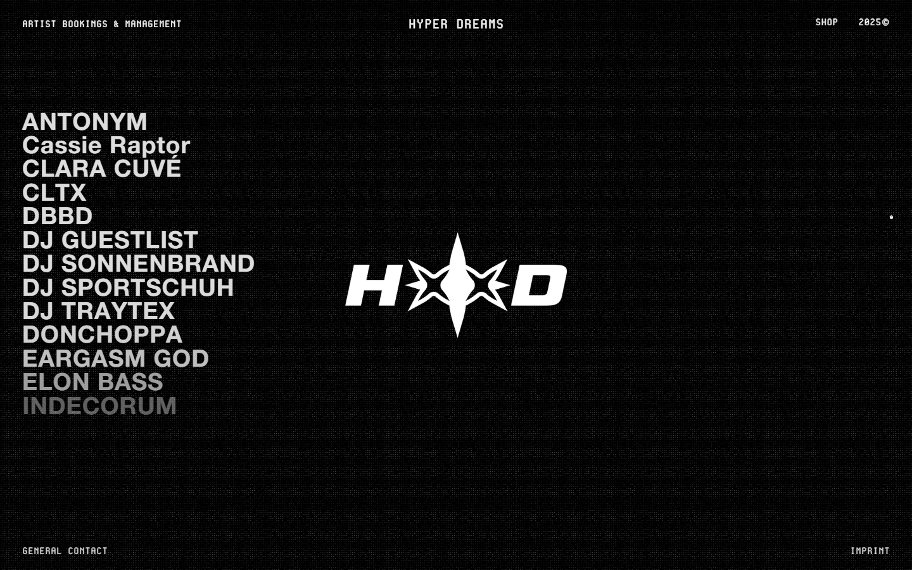
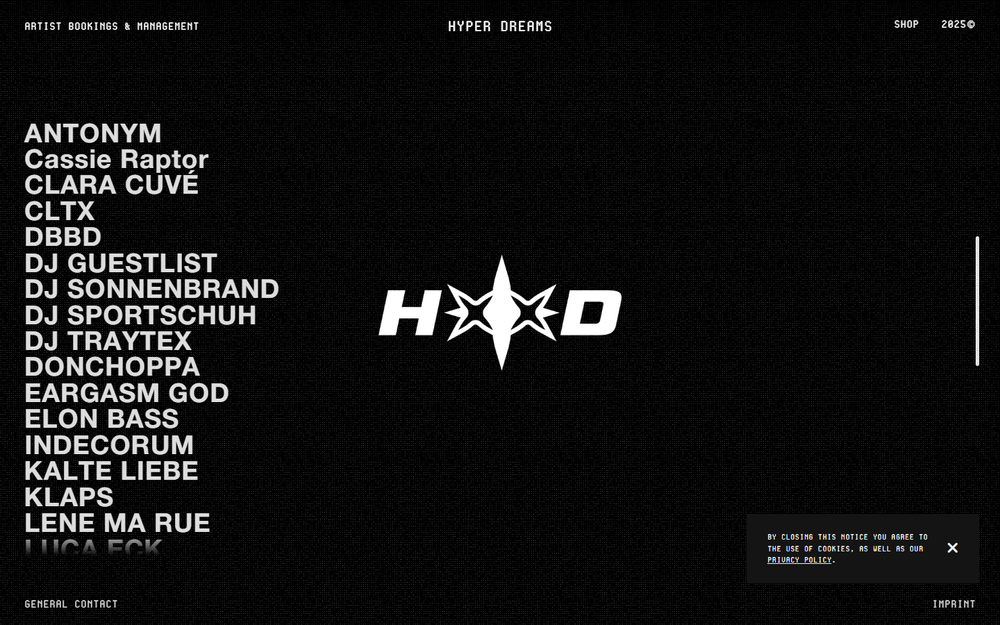

# Animation Reference

> Cinematic motion design extracted from live DOM. Follow these specs exactly to recreate the experience.

## Motion Technology Stack

| Library | Type | Notes |
|---------|------|-------|
| **PixiJS v5.1.5** | 3d |  |
| **Anime.js v3.2.1** | animation |  |
| **Web Animations API (9 active)** | animation |  |

## Scroll Journey

The page is **900px** tall. Each frame below shows what the user sees at that scroll depth.

> **Use these screenshots to understand WHAT animates, WHEN it animates, and HOW it moves.**

### 0% — Top / Hero
Scroll position: 0px



### 17% — Opening Section
Scroll position: 0px


### 33% — First Feature Section
Scroll position: 0px



### 50% — Mid-Page
Scroll position: 0px


### 67% — Lower Content
Scroll position: 0px


### 83% — Near Footer
Scroll position: 0px


### 100% — Bottom / Footer
Scroll position: 0px


## Scroll Animation Patterns

| Pattern | Library | Element Count | Duration | Delay | Easing |
|---------|---------|---------------|----------|-------|--------|
| scroll-trigger | GSAP | 1 | — | — | — |

### GSAP Implementation

```javascript
// GSAP ScrollTrigger
gsap.registerPlugin(ScrollTrigger);

gsap.from('.element', {
  opacity: 0,
  y: 60,
  duration: 0.8,
  ease: 'power2.out',
  scrollTrigger: {
    trigger: '.element',
    start: 'top 80%',
    end: 'bottom 20%',
  }
});
```

## CSS Keyframes (18 extracted)

### `@keyframes fa-spin`

Duration: `var(--fa-animation-duration,2s)` · Easing: `var(--fa-animation-timing,linear)` · Iteration: `var(--fa-animation-iteration-count,infinite)`

Used by: `.fa-spin`, `.fa-pulse, .fa-spin-pulse`

```css
@keyframes fa-spin {
  0% {
    transform: rotate(0deg);
  }
  100% {
    transform: rotate(1turn);
  }
}
```

> Transform/motion animation

### `@keyframes fa-spin`

Duration: `var(--fa-animation-duration,2s)` · Easing: `var(--fa-animation-timing,linear)` · Iteration: `var(--fa-animation-iteration-count,infinite)`

Used by: `.fa-spin`, `.fa-pulse, .fa-spin-pulse`

```css
@keyframes fa-spin {
  0% {
    transform: rotate(0deg);
  }
  100% {
    transform: rotate(1turn);
  }
}
```

> Transform/motion animation

### `@keyframes spin`

Duration: `0.8s` · Easing: `linear` · Delay: `0s` · Iteration: `infinite` · Fill: `none`

Used by: `.w-lightbox-spinner`

```css
@keyframes spin {
  0% {
    transform: rotate(0deg);
  }
  100% {
    transform: rotate(360deg);
  }
}
```

> Transform/motion animation

### `@keyframes fa-beat`

Duration: `var(--fa-animation-duration,1s)` · Easing: `var(--fa-animation-timing,ease-in-out)` · Delay: `var(--fa-animation-delay,0s)` · Iteration: `var(--fa-animation-iteration-count,infinite)`

Used by: `.fa-beat`

```css
@keyframes fa-beat {
  0%, 90% {
    transform: scale(1);
  }
  45% {
    transform: scale(var(--fa-beat-scale,1.25));
  }
}
```

> Transform/motion animation

### `@keyframes fa-beat`

Duration: `var(--fa-animation-duration,1s)` · Easing: `var(--fa-animation-timing,ease-in-out)` · Delay: `var(--fa-animation-delay,0s)` · Iteration: `var(--fa-animation-iteration-count,infinite)`

Used by: `.fa-beat`

```css
@keyframes fa-beat {
  0%, 90% {
    transform: scale(1);
  }
  45% {
    transform: scale(var(--fa-beat-scale,1.25));
  }
}
```

> Transform/motion animation

### `@keyframes fa-bounce`

Duration: `var(--fa-animation-duration,1s)` · Easing: `var(--fa-animation-timing,cubic-bezier(.28,.84,.42,1))` · Delay: `var(--fa-animation-delay,0s)` · Iteration: `var(--fa-animation-iteration-count,infinite)`

Used by: `.fa-bounce`

```css
@keyframes fa-bounce {
  0% {
    transform: scale(1) translateY(0px);
  }
  10% {
    transform: scale(var(--fa-bounce-start-scale-x,1.1),var(--fa-bounce-start-scale-y,.9)) translateY(0);
  }
  30% {
    transform: scale(var(--fa-bounce-jump-scale-x,.9),var(--fa-bounce-jump-scale-y,1.1)) translateY(var(--fa-bounce-height,-.5em));
  }
  50% {
    transform: scale(var(--fa-bounce-land-scale-x,1.05),var(--fa-bounce-land-scale-y,.95)) translateY(0);
  }
  57% {
    transform: scale(1) translateY(var(--fa-bounce-rebound,-.125em));
  }
  64% {
    transform: scale(1) translateY(0px);
  }
  100% {
    transform: scale(1) translateY(0px);
  }
}
```

> Transform/motion animation

### `@keyframes fa-bounce`

Duration: `var(--fa-animation-duration,1s)` · Easing: `var(--fa-animation-timing,cubic-bezier(.28,.84,.42,1))` · Delay: `var(--fa-animation-delay,0s)` · Iteration: `var(--fa-animation-iteration-count,infinite)`

Used by: `.fa-bounce`

```css
@keyframes fa-bounce {
  0% {
    transform: scale(1) translateY(0px);
  }
  10% {
    transform: scale(var(--fa-bounce-start-scale-x,1.1),var(--fa-bounce-start-scale-y,.9)) translateY(0);
  }
  30% {
    transform: scale(var(--fa-bounce-jump-scale-x,.9),var(--fa-bounce-jump-scale-y,1.1)) translateY(var(--fa-bounce-height,-.5em));
  }
  50% {
    transform: scale(var(--fa-bounce-land-scale-x,1.05),var(--fa-bounce-land-scale-y,.95)) translateY(0);
  }
  57% {
    transform: scale(1) translateY(var(--fa-bounce-rebound,-.125em));
  }
  64% {
    transform: scale(1) translateY(0px);
  }
  100% {
    transform: scale(1) translateY(0px);
  }
}
```

> Transform/motion animation

### `@keyframes fa-fade`

Easing: `var(--fa-animation-timing,cubic-bezier(.4,0,.6,1))` · Iteration: `var(--fa-animation-iteration-count,infinite)`

Used by: `.fa-fade`

```css
@keyframes fa-fade {
  50% {
    opacity: var(--fa-fade-opacity,.4);
  }
}
```

> Opacity fade

### `@keyframes fa-fade`

Easing: `var(--fa-animation-timing,cubic-bezier(.4,0,.6,1))` · Iteration: `var(--fa-animation-iteration-count,infinite)`

Used by: `.fa-fade`

```css
@keyframes fa-fade {
  50% {
    opacity: var(--fa-fade-opacity,.4);
  }
}
```

> Opacity fade

### `@keyframes fa-beat-fade`

Easing: `var(--fa-animation-timing,cubic-bezier(.4,0,.6,1))` · Iteration: `var(--fa-animation-iteration-count,infinite)`

Used by: `.fa-beat-fade`

```css
@keyframes fa-beat-fade {
  0%, 100% {
    opacity: var(--fa-beat-fade-opacity,.4);
    transform: scale(1);
  }
  50% {
    opacity: 1;
    transform: scale(var(--fa-beat-fade-scale,1.125));
  }
}
```

> Fade + motion enter animation

### `@keyframes fa-beat-fade`

Easing: `var(--fa-animation-timing,cubic-bezier(.4,0,.6,1))` · Iteration: `var(--fa-animation-iteration-count,infinite)`

Used by: `.fa-beat-fade`

```css
@keyframes fa-beat-fade {
  0%, 100% {
    opacity: var(--fa-beat-fade-opacity,.4);
    transform: scale(1);
  }
  50% {
    opacity: 1;
    transform: scale(var(--fa-beat-fade-scale,1.125));
  }
}
```

> Fade + motion enter animation

### `@keyframes fa-flip`

Duration: `var(--fa-animation-duration,1s)` · Easing: `var(--fa-animation-timing,ease-in-out)` · Delay: `var(--fa-animation-delay,0s)` · Iteration: `var(--fa-animation-iteration-count,infinite)`

Used by: `.fa-flip`

```css
@keyframes fa-flip {
  50% {
    transform: rotate3d(var(--fa-flip-x,0),var(--fa-flip-y,1),var(--fa-flip-z,0),var(--fa-flip-angle,-180deg));
  }
}
```

> Transform/motion animation

### `@keyframes fa-flip`

Duration: `var(--fa-animation-duration,1s)` · Easing: `var(--fa-animation-timing,ease-in-out)` · Delay: `var(--fa-animation-delay,0s)` · Iteration: `var(--fa-animation-iteration-count,infinite)`

Used by: `.fa-flip`

```css
@keyframes fa-flip {
  50% {
    transform: rotate3d(var(--fa-flip-x,0),var(--fa-flip-y,1),var(--fa-flip-z,0),var(--fa-flip-angle,-180deg));
  }
}
```

> Transform/motion animation

### `@keyframes fa-shake`

Duration: `var(--fa-animation-duration,1s)` · Easing: `var(--fa-animation-timing,linear)` · Iteration: `var(--fa-animation-iteration-count,infinite)`

Used by: `.fa-shake`

```css
@keyframes fa-shake {
  0% {
    transform: rotate(-15deg);
  }
  4% {
    transform: rotate(15deg);
  }
  8%, 24% {
    transform: rotate(-18deg);
  }
  12%, 28% {
    transform: rotate(18deg);
  }
  16% {
    transform: rotate(-22deg);
  }
  20% {
    transform: rotate(22deg);
  }
  32% {
    transform: rotate(-12deg);
  }
  36% {
    transform: rotate(12deg);
  }
  40%, 100% {
    transform: rotate(0deg);
  }
}
```

> Transform/motion animation

### `@keyframes fa-shake`

Duration: `var(--fa-animation-duration,1s)` · Easing: `var(--fa-animation-timing,linear)` · Iteration: `var(--fa-animation-iteration-count,infinite)`

Used by: `.fa-shake`

```css
@keyframes fa-shake {
  0% {
    transform: rotate(-15deg);
  }
  4% {
    transform: rotate(15deg);
  }
  8%, 24% {
    transform: rotate(-18deg);
  }
  12%, 28% {
    transform: rotate(18deg);
  }
  16% {
    transform: rotate(-22deg);
  }
  20% {
    transform: rotate(22deg);
  }
  32% {
    transform: rotate(-12deg);
  }
  36% {
    transform: rotate(12deg);
  }
  40%, 100% {
    transform: rotate(0deg);
  }
}
```

> Transform/motion animation

### `@keyframes fillProgress`

Duration: `4.5s` · Easing: `cubic-bezier(0.42, 0, 0.58, 1)` · Delay: `0s` · Iteration: `infinite` · Fill: `none`

Used by: `.progress`

```css
@keyframes fillProgress {
  0% {
    height: 0px;
  }
  90% {
    height: 101%;
  }
  100% {
    height: 0px;
  }
}
```

> Dimension expand/collapse

### `@keyframes grained`

Duration: `0.5s` · Easing: `steps(20)` · Iteration: `infinite`

Used by: `#grain-overlay::before`

```css
@keyframes grained {
  0% {
    transform: translate(-10%, 10%);
  }
  10% {
    transform: translate(-25%, 0%);
  }
  20% {
    transform: translate(-30%, 10%);
  }
  30% {
    transform: translate(-30%, 30%);
  }
  40% {
  }
  50% {
    transform: translate(-15%, 10%);
  }
  60% {
    transform: translate(-20%, 20%);
  }
  70% {
    transform: translate(-5%, 20%);
  }
  80% {
    transform: translate(-25%, 5%);
  }
  90% {
    transform: translate(-30%, 25%);
  }
  100% {
    transform: translate(-10%, 10%);
  }
}
```

> Transform/motion animation

### `@keyframes grained`

Duration: `0.5s` · Easing: `steps(20)` · Iteration: `infinite`

Used by: `#grain-overlay::before`

```css
@keyframes grained {
  0% {
    transform: translate(-10%, 10%);
  }
  10% {
    transform: translate(-25%, 0%);
  }
  20% {
    transform: translate(-30%, 10%);
  }
  30% {
    transform: translate(-30%, 30%);
  }
  40% {
  }
  50% {
    transform: translate(-15%, 10%);
  }
  60% {
    transform: translate(-20%, 20%);
  }
  70% {
    transform: translate(-5%, 20%);
  }
  80% {
    transform: translate(-25%, 5%);
  }
  90% {
    transform: translate(-30%, 25%);
  }
  100% {
    transform: translate(-10%, 10%);
  }
}
```

> Transform/motion animation

## Global Transition Declarations

These `transition` values were extracted from CSS rules across the site:

```css
transition: inherit;
transition: unset;
transition: background-color 0.1s, color 0.1s;
transition: 0.3s;
transition: 0.2s;
transition: 0.2s cubic-bezier(0.215, 0.61, 0.355, 1);
transition: 0.2s cubic-bezier(0.165, 0.84, 0.44, 1);
transition: color 0.2s;
transition: 0.1s ease-in-out;
```

## How to Recreate This Motion Design

### Step 1 — Install Dependencies

```bash
npm install pixi.js
npm install animejs
```

### Step 2 — Scroll-Reveal Pattern

Elements that animate into view follow this pattern:

```css
/* Initial hidden state */
.reveal {
  opacity: 0;
  transform: translateY(40px);
  transition: opacity 0.6s cubic-bezier(0.4, 0, 0.2, 1),
              transform 0.6s cubic-bezier(0.4, 0, 0.2, 1);
}
.reveal.visible {
  opacity: 1;
  transform: translateY(0);
}
```

### Step 3 — Key Motion Principles

- **Duration scale:** `0.1s` · `0.3s` · `0.2s` — use these values, never invent new durations
- **Always add** `@media (prefers-reduced-motion: reduce) { * { animation-duration: 0.01ms !important; transition-duration: 0.01ms !important; } }`

### Step 4 — Scroll Journey Reference

Match what happens at each scroll position:

- **0%** (`0px`) → `screens/scroll/scroll-000.png`
- **17%** (`0px`) → `screens/scroll/scroll-017.png`
- **33%** (`0px`) → `screens/scroll/scroll-033.png`
- **50%** (`0px`) → `screens/scroll/scroll-050.png`
- **67%** (`0px`) → `screens/scroll/scroll-067.png`
- **83%** (`0px`) → `screens/scroll/scroll-083.png`
- **100%** (`0px`) → `screens/scroll/scroll-100.png`

